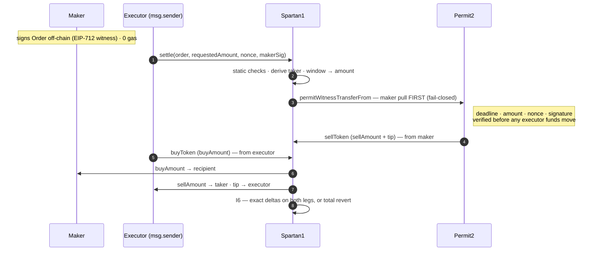

<h1 align="center">Λ&nbsp;&nbsp;S P A R T A N 1</h1>

<p align="center">
  
  
  
  
  
</p>

<h3 align="center">Exact-settlement RFQ primitive on Permit2.<br/>One contract. One function. Zero trust added.</h3>

---

**Spartan1** is a thin enforcement adapter over the [Permit2](https://github.com/Uniswap/permit2) singleton for firm-quote token swaps. A maker signs an EIP-712 `Order` with exact amounts on both legs; the signature is a Permit2 *witness* that cryptographically binds the entire Order. Permissionless executors settle it on-chain. The contract holds no funds, validates no prices, and has no owner, proxy, oracle, governance, storage, or configurable fees.

The name is the design rule: like a Spartan, the protocol carries only what it needs — every feature that is not essential to exact settlement is left out, permanently.

> **Honest positioning.** Spartan1 offers *tighter guarantees on specific properties* — atomic exactness, per-operation blast radius, minimal surface — not overall superiority over 0x Settler, UniswapX, or CoW. Those systems optimize liquidity, routing, and ecosystem; Spartan1 deliberately does not. It is a more minimal settlement layer, not a better everything.

---

## Contents

**This file** — [Why Spartan1?](#why-spartan1) · [How `settle()` works](#how-settle-works) · [Quick start](#quick-start) · [Repository layout](#repository-layout) · [Build & test](#build--test) · [FAQ](#faq) · [Dependencies](#dependencies) · [Security](#security) · [License](#license--disclaimer)

**Reference documents**

- **[SPEC.md](SPEC.md)** — the `Order`, the `settle()` lifecycle, Permit2 ordering, invariants I0–I11, the frozen scope, the canonical test vector
- **[THREAT_MODEL.md](THREAT_MODEL.md)** — security model (authorization vs settlement) + the full threat table: impossible / mitigated / declared residual
- **[ARCHITECTURE.md](ARCHITECTURE.md)** — the off-chain layer: relays and anti-Sybil, wallet & aggregator integration, the blocking test gate
- **[DEPLOY.md](DEPLOY.md)** — deploy → verify on-chain → re-freeze the vector → fork gate → audit · **[SECURITY.md](SECURITY.md)** — reporting a vulnerability · **[CHANGELOG.md](CHANGELOG.md)**

---

## Why Spartan1?

Spartan1 is not trying to be a better DEX. It trades scope for **tighter, provable guarantees on a narrow set of properties** — and is explicit about what it gives up to get them.

| Tighter on | Deliberately not |
|---|---|
| **Atomic exactness** — both legs settle at the signed amounts, proven on-chain (I6), or the whole tx reverts | Liquidity, routing, or price discovery — no oracle, no fair-value logic |
| **Per-operation blast radius** — makers sign via Permit2; zero standing allowance to Spartan1 | An aggregator or ecosystem — it is a settlement *primitive*, integrated behind existing frontends |
| **Minimal surface** — one file, one function, one library, one trust anchor, no storage/owner/proxy | An everything-store — `settleBatch` / `settleCross` are permanently out of scope, by decision |

If you need deep liquidity and smart routing, use 0x / UniswapX / CoW. If you need a firm-quote swap that either executes exactly as signed or not at all, that is this.

---

## How `settle()` works

One function. The maker is pulled **first**, through Permit2, so every check (deadline, amount, nonce, signature) happens before any executor funds move; the transaction then proves both legs moved exactly the signed amounts, or reverts entirely.



Step-by-step lifecycle, the `Order` struct, and invariants I0–I11: **[SPEC.md](SPEC.md)**.

---

## Quick start

```bash
# submodules hold the pinned Permit2 / Solady / solmate / forge-std
git clone --recursive https://github.com/arabafenice599rae/Spartan1.git && cd Spartan1
git submodule update --init --recursive   # only if you cloned without --recursive
forge build && forge test        # 21 passed; 1 skipped (gate 10 needs L2_RPC)
pip install -r requirements.txt  # exact pins — supply-chain lock
python client/test_spartan1.py   # triple-digest harness: must reproduce the canonical digest
```

Foundry fetches solc `0.8.24` automatically. The suite deploys the **real** Permit2 (etched from its canonical bytecode), so no fork or RPC is needed for gates 1–9.

---

## Repository layout

```text
spartan1/
├── index.html             # project landing page — recomputes the frozen digest in your browser
├── src/Spartan1.sol       # the contract (~80–100 lines)
├── test/Spartan1.t.sol    # Foundry: gate tests (2/3/5 first), fuzz, invariants, fork
├── client/                # order.py — THE single source of truth — + the triple-digest harness
├── distribution/          # openapi.yaml · relay.py · maker.py · executor.py · index.html (dApp)
│                          # relays.json (convenience) · deployments.json (AUTHORITATIVE addresses)
│                          # test_{relay,maker,executor}.py — every guardrail violated one by one
├── sdk/                   # TypeScript SDK — constants GENERATED from order.py, digest-gated
├── scripts/               # gen_constants · check_coherence (cross-leg gate) · refreeze_spender
│                          # ci_no_unexpected_skips — gate 10 is the ONLY permitted skip in CI
├── .githooks/pre-commit   # optional local convenience — runs the coherence gate; NOT a gate
├── .github/workflows/     # ci.yml — every gate on push/PR; gate 10 = declared SKIP, surfaced
└── SPEC.md · THREAT_MODEL.md · ARCHITECTURE.md · DEPLOY.md · SECURITY.md · CHANGELOG.md
                           # requirements.txt · foundry.toml · LICENSE
```

Build order is fixed: **core first** (`Spartan1.sol` + tests 2/3/5 written before the contract), fork gate green, *then* the distribution layer against the proven Order shape.

**Status.** Core and distribution layer are built and gated — relay 105 · maker 63 · executor 26 · SDK 27 · forge 21 (+1 declared skip) — with the frozen literals, the anti-placebo sentinel and `deployments.json` policed by `scripts/check_coherence.py`. **Still open:** the on-chain fork gate (test 10, needs `L2_RPC`) and the `spender` re-freeze with the deployed address. The off-chain loop is tested; **settlement is not yet proven on-chain**, and nothing is audited or deployed.

---

## Build & test

```bash
forge test --fork-url $L2_RPC         # gate tests 2/3/5/10 against real Permit2 (else gate 10 skips)
python3 distribution/test_relay.py    # relay conformance + openapi schema + cross-leg coherence
python3 distribution/test_maker.py    # every maker guardrail violated one by one
python3 distribution/test_executor.py # every executor guardrail, incl. the taker guard + e2e
python3 scripts/check_coherence.py    # exit 0 = every frozen literal agrees, in every leg
cd sdk && npm install && npm run typecheck && npm test    # tsc --noEmit strict; node --test
git config core.hooksPath .githooks   # optional, one-time: pre-commit runs the coherence gate
```

`.githooks/pre-commit` is a **convenience, not a gate**: hooks are per-clone, opt-in and bypassable with `git commit --no-verify`, so nothing in the security argument may depend on it having run. CI is the gate.

CI (`.github/workflows/ci.yml`) runs all of the above on every push and PR. The on-chain fork gate (test 10) is a **declared SKIP** — it needs an external L2 RPC (flaky, and buys nothing on a public repo) — surfaced in the job summary rather than hidden behind a green badge, and `ci_no_unexpected_skips.py` enforces that it is the *only* skip anywhere. Deployment is manual, never triggered by push; the full order is in [DEPLOY.md](DEPLOY.md). First chains: Base / Arbitrum.

---

## FAQ

**How is this different from 0x Settler, UniswapX, or CoW?**
Those optimize liquidity, routing, and ecosystem. Spartan1 doesn't — it is a firm-quote settlement *primitive* with tighter guarantees on atomic exactness and blast radius (see [Why Spartan1?](#why-spartan1) and the [security model](THREAT_MODEL.md#security-model)). Use them for liquidity; use this for exact-or-revert settlement.

**Is it deployed, audited, safe for production?**
No, no, and not yet. No deployment with real capital should happen without an **independent external audit** — the [test gate](ARCHITECTURE.md#test-gate) is a precondition to that audit, not a substitute. The off-chain loop is tested end to end; **on-chain settlement is still the open fork gate (test 10)**, and the `spender` is still a placeholder to be re-frozen with the deployed address.

**Which wallets are supported?**
Any wallet with `eth_signTypedData_v4` (MetaMask, Rabby, Coinbase…) works today — the only prerequisite is the one-time `approve(Permit2)` per token. Smart-account makers sign via ERC-1271; tested scope is EOA + Safe + common smart wallets. Counterfactual EIP-6492 is out of scope, and an EIP-7702 delegate without `isValidSignature` reverts cleanly (never mis-verifies).

**Does the maker pay gas?**
No. Makers sign off-chain and pay zero gas; the executor submits the tx and pays gas, recovered from the tip in the fallback window.

**Which tokens work?**
Any standard ERC-20 via Permit2. Fee-on-transfer and rebasing tokens are *non-settleable by choice* — I6 reverts them rather than allow a silent loss.

---

## Dependencies

| Dependency | Role | Policy |
|---|---|---|
| [Permit2](https://github.com/Uniswap/permit2) | authorization: witness, nonce, deadline, chainId, pull | canonical `0x000000000022D473030F116dDEE9F6B43aC78BA3`, immutable constructor arg, `code.length > 0` asserted at deploy |
| [Solady](https://github.com/Vectorized/solady) | `ReentrancyGuardTransient` (SSTORE fallback off-mainnet by default) + `SafeTransferLib` (+ `balanceOf`) | **pinned to commit [`ab96a83`](https://github.com/Vectorized/solady/commit/ab96a830e705de13e0f58cfaefadab4ac8257655)**; `balanceOf` assembly + reentrancy fallback verified live against this commit |

No other runtime dependency. Ever.

**Test-only pins** (exact — the gate is green only against these; Solady is rolling, so it is pinned by commit): [`permit2 cc56ad0`](https://github.com/Uniswap/permit2/commit/cc56ad0f3439c502c246fc5cfcc3db92bb8b7219) · [`solmate 8d910d8`](https://github.com/transmissions11/solmate/commit/8d910d876f51c3b2585c9109409d601f600e68e1) · [`forge-std 6e8c4a9`](https://github.com/foundry-rs/forge-std/commit/6e8c4a92c9a8b31c1b0f0c39296d1fa4695c7df8). The suite deploys the **real** Permit2 (etched from its canonical bytecode at `0x0000…22D473…`), never a mock.

---

## Security

- Any deployment with real capital must be preceded by an **independent external audit**. The [test gate](ARCHITECTURE.md#test-gate) is a *precondition* to the audit, not a substitute for it.
- The single most critical technical surface is the **witness type string / typehash** (Across M-06 / OIF failure class). Defense: single source in `client/order.py`, generated everywhere else, known-digest CI check, negative tamper test on all ten Order fields.
- The adversary analysis — impossible / mitigated / declared residual — is in **[THREAT_MODEL.md](THREAT_MODEL.md)**.
- To report a vulnerability, follow **[SECURITY.md](SECURITY.md)** (private advisory; please do not open a public issue).

---

## License & disclaimer

Released under the **MIT** license — matching the `SPDX-License-Identifier: MIT` in `src/Spartan1.sol` (the identifier that lands in on-chain source verification), and consistent with Permit2 and Solady, both MIT. See [`LICENSE`](./LICENSE).

This software is provided *as is*, without warranty of any kind. Nothing here is financial advice. Firm-quote market making carries adverse-selection risk; executing carries inventory and volatility risk. You are responsible for your own keys, allowances, and capital.

---

<p align="center"><sub><b>Spartan1</b> — exact settlement, nothing else. Λ</sub></p>
